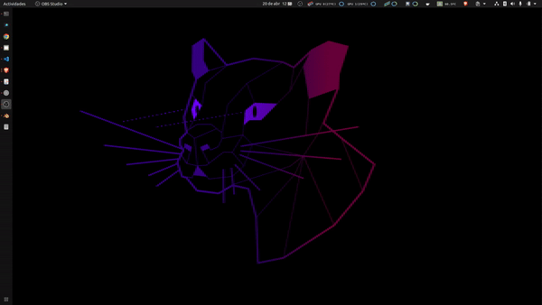

# Disk monitor

🖥️ Disk monitor for Ubuntu: The ultimate real-time disk tracking tool. Monitor your disk memory usage directly from your Ubuntu menu bar with Disk Monitor. This user-friendly and efficient application is fully integrated with the latest Ubuntu operating system. Get live updates and optimize your development tasks. Download now and take control of your disk today!



## About Disk Monitor
Disk Monitor is an intuitive tool designed for developers and professionals who need to keep an eye on their disk memory usage in real time. It integrates seamlessly with the Ubuntu menu bar, providing essential information at your fingertips.

## Key Features
 * Real-time Monitoring: View disk memory usage, all updated live.
 * Optimized for Ubuntu: Crafted to integrate flawlessly with the latest Ubuntu OS.

## Installation

### Clone the repository

```bash
git clone https://github.com/maximofn/disk_monitor.git
```

or with `ssh`

```bash
git clone git@github.com:maximofn/disk_monitor.git
```

### Install the dependencies

Make sure that you do not have any `venv` or `conda` environment installed.

```bash
if [ -n "$VIRTUAL_ENV" ]; then
    deactivate
fi
if command -v conda &>/dev/null; then
    conda deactivate
fi
```

Now install the dependencies

```bash
sudo apt install lm-sensors
```

Select YES to all questions

```bash
sudo sensors-detect
```

Install psensor

```bash
sudo apt install psensor
```

Install python3-pip

```bash
sudo apt install python3-pip
```

Install matplotlib

```bash
pip3 install matplotlib
```

## Execution at start-up

```bash
add_to_startup.sh
```

Then when you restart your computer, the Disk Monitor will start automatically.

## Support

Consider giving a **☆ Star** to this repository, if you also want to invite me for a coffee, click on the following button

[](https://www.buymeacoffee.com/maximofn)