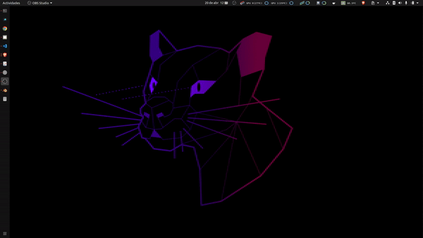

# Disk monitor

Disk usage indicator for the Ubuntu/GNOME panel: live mount-by-mount usage with a per-mount donut and percentage. Daemon (`disk-monitord`) sits on `/proc/mounts` + `statvfs`, frontend (`disk-monitor-tray`) talks to it over HTTP/SSE.



The legacy Python script lives in `legacy/disk_monitor.py` and still works; the Rust rewrite below is the recommended path going forward (RSS ~10× lower, CPU ~100× lower).

> **Sister monitors:** [gpu_monitor](https://github.com/maximofn/gpu_monitor), `cpu_monitor`, `ram_monitor`. Independent repos so you can install only the ones that match your hardware.

## Architecture

Cargo workspace, three crates:

```
crates/disk-monitor-core   →  shared serde types (Snapshot / Mount / Usage)
crates/disk-monitord       →  HTTP+SSE daemon (binds 127.0.0.1:9126 by default)
crates/disk-monitor-tray   →  Linux system-tray frontend (ksni + tiny-skia + freetype)
```

API: REST + Server-Sent Events, JSON payloads. See [`docs/api.md`](docs/api.md).

## Build

```bash
cargo build --release --workspace
```

## Run (manual, for development)

```bash
./target/release/disk-monitord                        # foreground daemon
./target/release/disk-monitor-tray                    # tray icon (separate terminal)
```

Daemon listens on `127.0.0.1:9126`. Override with `--bind`/`--port` or `DISK_MONITORD_BIND` / `DISK_MONITORD_PORT`.

To verify with curl:

```bash
curl http://127.0.0.1:9126/v1/snapshot | jq
curl -N http://127.0.0.1:9126/v1/stream
```

## Install

Build, then copy binaries + assets + service files into your home tree:

```bash
cargo build --release --workspace

mkdir -p ~/.local/bin ~/.local/share/disk-monitor ~/.config/systemd/user ~/.config/autostart
install -m 0755 target/release/disk-monitord     ~/.local/bin/
install -m 0755 target/release/disk-monitor-tray ~/.local/bin/
install -m 0644 assets/disk.png                  ~/.local/share/disk-monitor/
install -m 0644 packaging/systemd/disk-monitord.service ~/.config/systemd/user/
install -m 0644 packaging/autostart/disk-monitor-tray.desktop ~/.config/autostart/

systemctl --user daemon-reload
systemctl --user enable --now disk-monitord
```

The tray autostarts on next login. To start it now without logging out:

```bash
nohup ~/.local/bin/disk-monitor-tray >/dev/null 2>&1 & disown
```

> The tray is a `.desktop` autostart, **not** a systemd service — it needs the
> graphical session (DBus user bus + panel) to be up before it can plant its
> icon. After rebuilding the tray binary, restart it with `pkill` + relaunch
> (or just log out / log in); `systemctl --user restart disk-monitor-tray`
> won't work because no such unit exists.

### Legacy (Python)

If you still want to run `legacy/disk_monitor.py` instead of the Rust path:

```bash
sudo apt install python3-pip
pip3 install psutil matplotlib
```

## Dev tips

```bash
cargo test --workspace
cargo clippy --workspace -- -D warnings
cargo fmt --all

# Render the panel icon to a PNG and exit (no DBus, no GNOME):
./target/release/disk-monitor-tray --backend-url http://127.0.0.1:9126 --dump-icon /tmp/icon.png
```

`--mock` on the daemon serves a synthetic two-mount snapshot, useful in CI or on a machine where `/proc/mounts` is locked down.

## Support

If this is useful, give the repo a ★. If you want to buy me a coffee:

[](https://www.buymeacoffee.com/maximofn)
